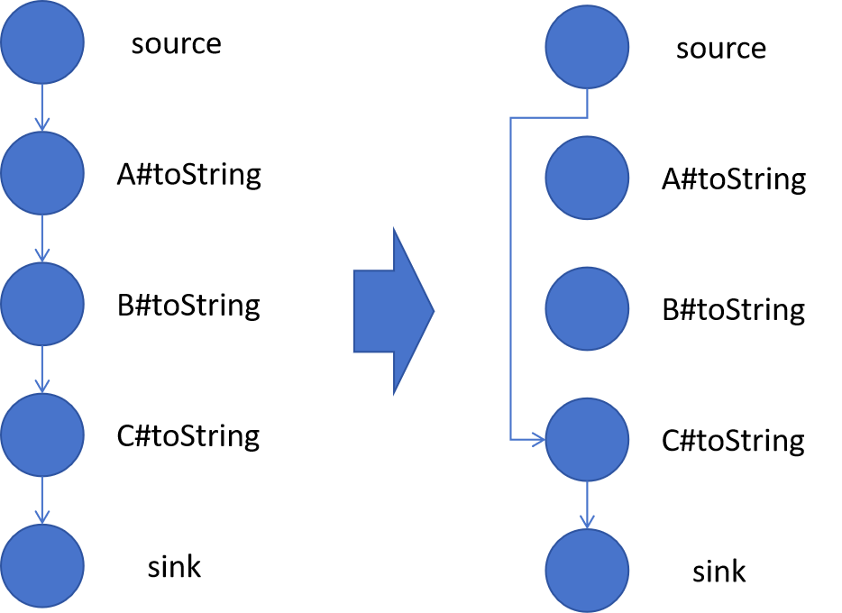
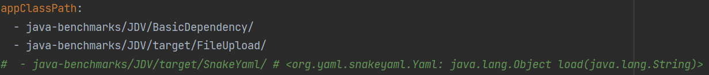
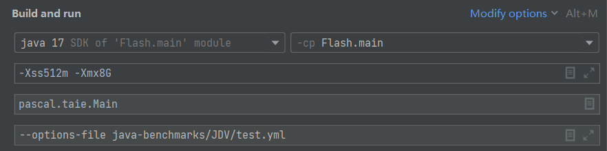

## Flash

Flash is a gadget chain detection tool towards efficient and precise call graph construction based on DDCA (Deserialization-Driven Controllability Analysis). The tool is built upon [Tai-e](https://github.com/pascal-lab/Tai-e).

### Design of Flash 

#### Deserialization-Driven Points-To Analysis

Deserialization-Driven Points-To Analysis (DDCA) is a novel demand-driven pointer analysis we develop to analysis the controllability of variables specific to deserialization scenario. To learn the basis about demand-driven pointer analysis, you can read the papers below :

- Heintze N, Tardieu O. Demand-driven pointer analysis[J]. ACM SIGPLAN Notices, 2001, 36(5): 24-34.
- Sridharan M, Gopan D, Shan L, et al. Demand-driven points-to analysis for Java[J]. ACM SIGPLAN Notices, 2005, 40(10): 59-76.
- Shang L, Xie X, Xue J. On-demand dynamic summary-based points-to analysis[C]//Proceedings of the Tenth International Symposium on Code Generation and Optimization. 2012: 264-274.
- ......

Here we list some key technical points :

- We use strings to represent controllability instead of numbers (GadgetInspector, Tabby), which helps us do reflection analysis
- For `transient` variables, inspired by the `classInitializer` of Tai-e, we first analyze the deserialization related methods of the class before analyzing a method to simulate the semantics and restore the controllability.
- We consider call site variables and method summaries variables as in demand.
- The queried results are cached and dynamic updated (as a cached pointer may have new source edge) to speed up.

#### Hybrid Method Dispatch

Flash resolves callees based on the controllability of receiver variable.

- Controllable call site
    - filter callees based on refined CHA
    - For Dynamic Proxy usage in exploitation, we collect a set of features that a call site should meet:
    
        - Implement Presence
        - Interface Call
        - No Cast
    
- New call site: Pointer Analysis

#### Reflection Analysis

For Reflection, inspired by the studies below, we use a controllable string and JavaBean analysis (model related APIs) to infer and filter targets :

- Song X, Wang Y, Cheng X, et al. Efficiently Trimming the Fat: Streamlining Software Dependencies with Java Reflection and Dependency Analysis[C]//Proceedings of the IEEE/ACM 46th International Conference on Software Engineering. 2024: 1-12.
- Li Y, Tan T, Sui Y, et al. Self-inferencing reflection resolution for Java[C]//ECOOP 2014–Object-Oriented Programming: 28th European Conference, Uppsala, Sweden, July 28–August 1, 2014. Proceedings 28. Springer Berlin Heidelberg, 2014: 27-53.

To see the summaries, please refer to [priori-knowledge file](./java-benchmarks/JDV/priori-knowledge.yml) :

- Controllable String -> String, StringBuilder, StringBuffer
- Controllable JavaBean -> PropertyDescriptor, Introspector

#### Gadget Chain De-Duplication

Note that existing detection tools may generate many redundant gadget chains. Flash first will remove intermediate redundant gadgets in the following case:

Subsequently, Flash will de-duplicate the results based on the source sink-pair strategy. To reduce false negatives, in the same source sink pair, we will also retain gadget chains with more diverse paths based on the gadget chain's subsignature.

### How to Use Flash

Before using Flash, make sure you know [how to use Tai-e](https://tai-e.pascal-lab.net/docs/current/reference/en/index-single.html).

Next, you need to specify some parameters in the configuration file (We provide an [example file](./java-benchmarks/JDV/test.yml) for reference).

#### Where We Modify Tai-e

Due to the lack of a demand-driven pointer analysis module in the current version of Tai-e, Flash was not implemented following its plug-in design. Instead, we modify the core implementation of the Tai-e framework, which areprimarily under `src/main/java/pascal/taie/analysis/dataflow/analysis`

#### Analysis Target

Just specific the `appClassPath` in the analysis configuration file. You can analyze multiple jars at the same time.

#### Params

The following are some key parameters:

- sources : `serializable`  (all deserialization-related methods, such as `readObject`, `readExternal`) or `method signature`
- filterNonSerializable : `true` or `false`, filter methods that their declaring classes not implement `java.io.Serializable`
- GC_MAX_LEN : the max length of a gadget chan that Flash will search
- outputDir: output directory of gadget chains
- GC_OUT : output file of gadget chains
- priori-knowledge : the file which contains manually created summaries for methods
- LCS_THRESHOLD: The lower value you set, the more different the gadget chains under the same source-sink pair you will get.

#### Run

If you are using IntelliJ IDEA, you will need to configure the run settings as follows:

~~~
-Xss512m -Xmx8G
--options-file java-benchmarks/JDV/test.yml
~~~

#### Filter Results

You can also filter the results based on the following script:

- key_filter.py : you can find a keyword that the library holds (i.e., `commons` in CommonsCollection3) to filter the unwanted results like the gadget chains totally composed of JDK classes.

#### Docker

We also provide Docker scripts for running Flash, with a pre-packaged version of Flash included in the `docker` directory.

### The Results of Flash

The dataset used in our evaluation, along with the new gadget chains detected by Flash, are included in the file Flash_GC.zip. Please refer to the included its README file for more details. Note that Flash is a static analysis tool, therefore, users need manually verify the newly discovered gadget chains (may refer to the examples provided in Flash_GC as a basis).

